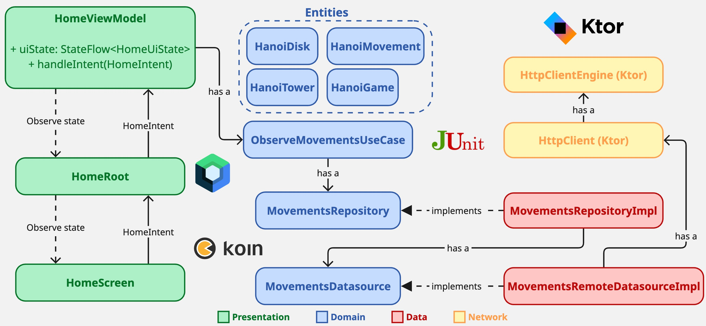
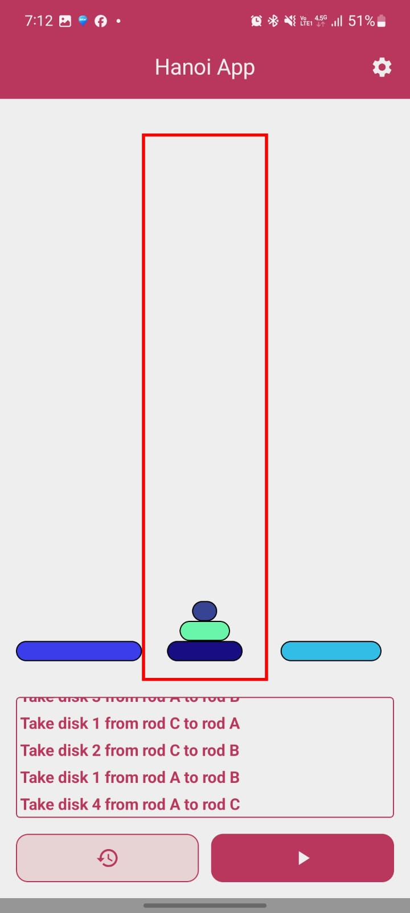
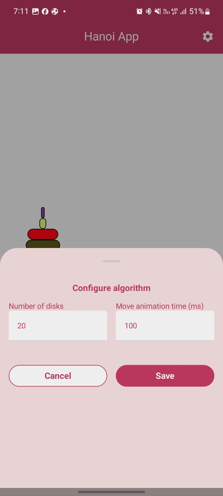

# 🧠 Hanoi App – Mobile Solution for the Tower of Hanoi Puzzle

This Android application was developed as part of the **Incode Technical Assignment** to visually solve and animate the classic **Tower of Hanoi** puzzle. Built with **Jetpack Compose** and a clean architecture, the app consumes a streaming API to render each move in real time.

---

## 🎮 Features

- Input disk count 
- Animated solution of the puzzle
- Real-time movement streaming from backend
- UI built with Jetpack Compose

---

## 🏗 Architecture

The app follows a **Clean Architecture** pattern:

- **UI Layer**: Composables
- **Presentation Layer**: ViewModel + StateFlow + MVI (handleIntent)
- **Domain Layer**: Business rules, movement modeling
- **Data Layer**: Remote data source with Flow



---

## 🖼 Screenshots

| Home Screen                | Solving Animation         |
|---------------------------|---------------------------|
|  |  |

---

## 🌐 Backend Integration

The app communicates with a Spring Boot service hosted on Render.  
The service streams moves as **NDJSON**, so the client can begin rendering as soon as the first move is computed.

**API Endpoint**:  
```http
GET https://hanoi-service.onrender.com/api/hanoi/{n}
```
Each line of response:
```http
{"start": 1, "end": 3}
```

---

## 🚀 Getting Started

- Clone this repo:
```http
git clone https://github.com/Sergio-OP/hanoi-app.git
```
- Open in Android Studio
- Run on an emulator or Android device

---

## 📁 Related Repositories

- 🖥️ Backend: [hanoi-service](https://github.com/Sergio-OP/hanoi-service)

---
